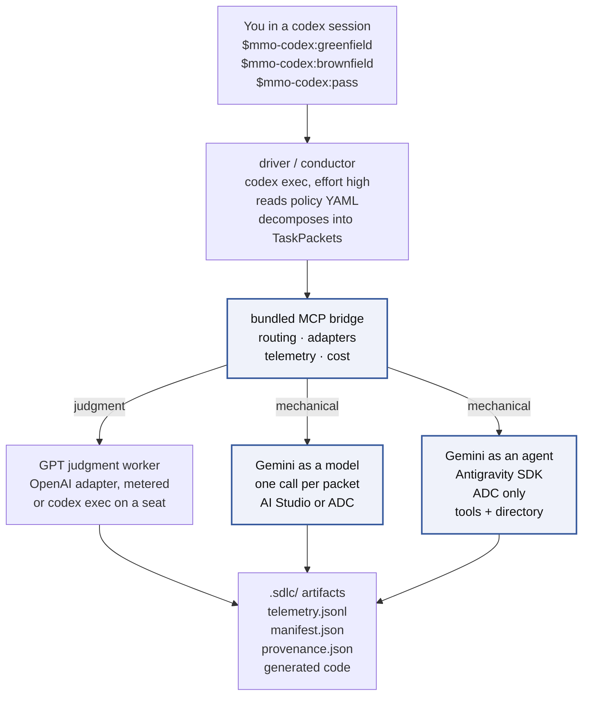
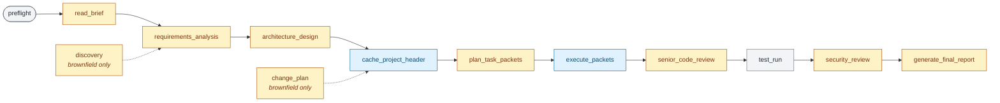
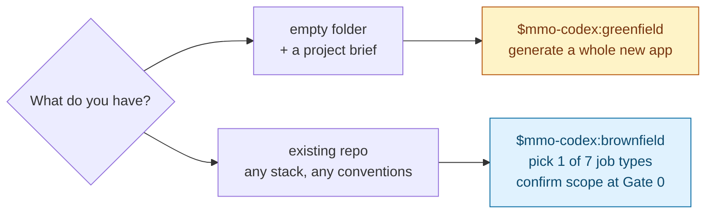

# AI-SDLC Orchestrator — Codex Harness

[](LICENSE)
[](https://github.com/tl-ai-labs/ai-sdlc-orchestrator-codex-harness/actions/workflows/test.yml)
[](.agents/plugins/marketplace.json)

## What this is

A Codex CLI plugin that runs a full SDLC pipeline — requirements → design → code → tests → docs → senior review → security review — against either an empty folder (**greenfield**) or an existing repository (**brownfield**). It routes each phase to the model that fits: judgment work stays on GPT, mechanical work drops to Gemini Flash.

This is a port of the [Claude Code harness](https://github.com/tl-ai-labs/ai-sdlc-orchestrator-claude-code-harness) — same pipeline, same job types, same briefs, driven by the Codex CLI instead. No Anthropic model or credential appears anywhere in the execution path. The carried Anthropic adapters stay compiled and tested but dormant, and the policies naming them are non-selectable replay fixtures, excluded from the picker.

Two ways to pay for the judgment tier reach the same model at the same effort pin — a metered `OPENAI_API_KEY`, or a `codex exec` subprocess on a ChatGPT seat. You pick which once, by choosing a policy. See [Running without an API key](#running-without-an-api-key) for what that costs in reporting precision.

Every generated file, every telemetry event, and every cost report lands under your project directory. Nothing is uploaded off the machine.

## Architecture

### System dataflow



The highlighted path is where cost drops — mechanical work routed off the judgment tier into the cheaper one. Which door the mechanical tier uses (model vs agent) is picked once at setup; both reach the same model at the same published rates.

Unlike the Claude harness, the driver calls the bridge itself rather than the model calling it as a tool. A model inside `codex exec` has no per-tool binding for an MCP server, so every dispatch in this harness is a shell call the driver makes — see [docs/verification/p1-codex-runtime.md](docs/verification/p1-codex-runtime.md).

### Phase timeline

A greenfield run walks 11 states in order. Brownfield inserts two more (`discovery`, `change_plan`) around the same core. Each state is color-coded by which tier does the work.



Legend — **amber:** GPT (judgment). **blue:** Gemini Flash (mechanical). **grey:** local — no model call.

Four HITL gates fire along the way: after requirements (Gate 1), after design (Gate 2), after security review (Gate 3), before final acceptance (Gate 4). Brownfield adds Gate 0 (discovery confirmation) before any of them.

The state machine in full is in [plugin/skills/pipeline/SKILL.md](plugin/skills/pipeline/SKILL.md).

## What it can do

### Tasks — the seven brownfield job types

Pick one at Gate 0 in `$mmo-codex:brownfield`.

| Job type | When to use | Who does the heavy lifting |
|---|---|---|
| `docs` | Write API docs, README, ADRs, docstrings | Gemini Flash |
| `bugfix` | Fix a specific defect (reproduce → diagnose → fix → regression test) | Gemini Flash · escalates to GPT after 2 failed retries |
| `feature-extend` | Add a capability to an existing endpoint or module | GPT for change plan · Gemini for the edits |
| `feature-new` | Add a new subsystem (endpoint + storage + tests) | GPT for design · Gemini for full codegen mix |
| `refactor` | Extract shared logic; runs the **full** test suite for invariants | GPT for refactor plan · Gemini for `refactor_extract` + patches |
| `test` | Backfill tests to a coverage target | Gemini Flash |
| `deps` | Upgrade a dependency + patch breaking-change fallout | GPT for dep-swap plan · Gemini for adjacent-code patches |

The intent-by-phase matrix is in [plugin/skills/pipeline/SKILL.md](plugin/skills/pipeline/SKILL.md).

### Routing — model per phase

Same rule applies to greenfield and brownfield. The default `gpt-plus-flash` policy routes:

| Phase | Tier | Model in the default policy |
|---|---|---|
| `requirements_analysis` · `architecture_design` · `plan_task_packets` | judgment | `gpt-5.6-terra`, effort `high` |
| `senior_code_review` · `security_review` | judgment | `gpt-5.6-terra`, effort `high` |
| `discovery` · `change_plan` (brownfield only) | judgment | `gpt-5.6-terra`, effort `high` |
| `execute_packets` (codegen) · `tests` · `docs` | mechanical | Gemini 3.7 Flash |
| `debug` (retry_count ≥ 2) | judgment | `gpt-5.6-terra` (auto-escalation) |
| `test_run` | local | Bash on your machine, no model call |

Source: [plugin/config/policies/gpt-plus-flash.yaml](plugin/config/policies/gpt-plus-flash.yaml). Every rule is data — change routing by editing the YAML, or author a new policy in the browser console via `$mmo-codex:policy change`.

Two guardrails ship on:

- **Escalation** — a mechanical-tier packet that fails validation twice auto-routes to GPT on the third attempt. Prevents infinite retries when Flash cannot solve a particular puzzle.
- **Hard cost cap** — `$50` per run (`hard_cost_cap_usd` in the policy). The driver aborts cleanly if accumulated cost crosses it. Raise or remove in your own policy.

Three policies ship as selectable:

| Policy | Judgment tier | Mechanical tier | Cost reporting |
|---|---|---|---|
| `gpt-plus-flash` (default) | GPT via the OpenAI API | Gemini Flash | Vendor-metered throughout — the policy of record |
| `gpt-seat-plus-flash` | GPT via local `codex exec` on a ChatGPT seat | Gemini Flash | Judgment cost is **modeled**, not metered |
| `flash-agsdk-only` | — | Gemini Flash via the agent worker | Mechanical only |

The driver and judgment legs are both GPT but are **not** the same credential: the conductor runs on the CLI's own login, while judgment work dispatches through the bridge as ordinary metered API calls. That separation is deliberate — it is what keeps per-phase cost attribution honest.

### Running without an API key

With a ChatGPT subscription and no `OPENAI_API_KEY`, select the subscription policy:

```bash
node plugin/scripts/setup-policy.mjs --policy=gpt-seat-plus-flash --project-root "$(pwd)"
```

It routes judgment work through a local `codex exec` subprocess on your seat instead of the metered API. Same model, same effort pin, same routing rules.

**The trade-off is in the cost figures, not the output.** Codex reports token counts but no cost, so judgment-tier cost becomes modeled rather than metered — telemetry labels those events `modeled`, and the run report keeps them out of the vendor total. Use `gpt-plus-flash` for anything whose cost numbers get published; use `gpt-seat-plus-flash` to develop, or to run at all without a key. A full run then draws judgment work from the same monthly seat allowance as the conductor.

## Greenfield vs. brownfield



| Mode | Skill | What it does |
|---|---|---|
| **Greenfield** | `$mmo-codex:greenfield` | Generates a whole new application from a project brief into `./src/`. Original flow the pipeline was built for. |
| **Brownfield** | `$mmo-codex:brownfield` | Extends an existing repository. Pick one of the seven job types above, confirm scope at Gate 0, run the pipeline with a non-destructive write contract that keeps off-limits files untouched. |

Both use the same install, same policies, same MCP dispatch layer.

## Prerequisites — what you actually need

Framed by what you want to do, not by every provider that exists. The full matrix — env vars, verify commands, failure modes — is in [SETUP.md](SETUP.md).

| If you want to… | You need |
|---|---|
| **Try it at all** | Node.js 20+, Codex CLI 0.151.0+ logged in (`codex login`), git 2.30+, macOS/Linux/WSL2, and either an `OPENAI_API_KEY` **or** a ChatGPT seat with the `gpt-seat-plus-flash` policy |
| **Get the cost drop on mechanical work** | The above, plus a Gemini surface — a `GEMINI_API_KEY` from [AI Studio](https://aistudio.google.com/app/apikey), or Application Default Credentials from `gcloud auth application-default login` |
| **Use the Antigravity agent path** | The above, plus Python 3.10+ (macOS ships 3.9, too old) **and** Vertex ADC — there is no API-key door for the agent path |

You do not need to pick a Gemini door yourself — setup asks. You do not need to write a policy — `gpt-plus-flash` loads by default.

## Setup

Install it as a plugin and the skills are available in every repository you work in:

```bash
codex plugin marketplace add https://github.com/tl-ai-labs/ai-sdlc-orchestrator-codex-harness
codex plugin add mmo-codex@tilicho-ai-labs
```

Then pick this project's policy and confirm the install:

```bash
node plugin/scripts/setup-policy.mjs --policy=gpt-plus-flash --project-root "$(pwd)"
node plugin/codex/verify-setup.mjs --fix
```

`--fix` installs the bridge's dependencies and compiles it. Credentials, the Gemini door choice, and the policy picker are covered step by step in [SETUP.md](SETUP.md).

> **Dispatch needs an unsandboxed session.** The bridge is reached by spawning it and talking over pipes, and codex's sandbox denies piped stdio under both its default and `workspace-write` modes. Start codex with `codex -s danger-full-access`, or run the pipeline headlessly, where the driver spawns the bridge outside codex.

## Commands

The workflow ships as 15 Codex skills. In a codex session, type `$` to mention one, or `/skills` to browse. Custom prompts are deprecated in codex, so there is no `/mmo:*` slash-command surface — the reasoning is recorded in [docs/verification/p1-codex-runtime.md](docs/verification/p1-codex-runtime.md).

### Run the pipeline

| Skill | What it does | When to use it |
|---|---|---|
| [`$mmo-codex:greenfield`](plugin/skills/greenfield/SKILL.md) | Runs the greenfield pipeline. Interviews you for the brief (or reads one you point at), confirms the output path, shows the routing plan, then starts spending. Takes no arguments. | Empty folder + a project brief. Generates a whole new app into `./src/`. |
| [`$mmo-codex:brownfield`](plugin/skills/brownfield/SKILL.md) | Runs the brownfield pipeline. Hydrates prior state, runs discovery (or resumes), asks for the intent and brief, freezes scope at Gate 0, then executes. Takes no arguments. | Existing repo. Extends the code you already have. |
| [`$mmo-codex:pass`](plugin/skills/pass/SKILL.md) | Headless twin of the above. Every setting a flag: `--auth`, `--policy`, `--study`, `--run-id`, and more. | CI, scripted replays, batch runs. |

### Run a specific brownfield job

Seven aliases into `$mmo-codex:brownfield`, each with the job type pre-selected — one shared manual, one Gate 0, no second pipeline. An optional free-text argument seeds the brief; Gate 0 still fires and still re-confirms scope either way.

| Skill | Job type | Example |
|---|---|---|
| [`$mmo-codex:docs`](plugin/skills/docs/SKILL.md) | `docs` | write API docs, README, ADRs, docstrings for the auth module |
| [`$mmo-codex:bugfix`](plugin/skills/bugfix/SKILL.md) | `bugfix` | fix the /login endpoint returning 500 on missing password |
| [`$mmo-codex:feature-extend`](plugin/skills/feature-extend/SKILL.md) | `feature-extend` | add a `?filter` param to the existing /users endpoint |
| [`$mmo-codex:feature-new`](plugin/skills/feature-new/SKILL.md) | `feature-new` | add a webhooks module (endpoint, storage, retry loop) |
| [`$mmo-codex:refactor`](plugin/skills/refactor/SKILL.md) | `refactor` | extract shared date logic into a util module and update all call sites |
| [`$mmo-codex:test`](plugin/skills/test/SKILL.md) | `test` | backfill unit tests for src/payments to reach 80% line coverage |
| [`$mmo-codex:deps`](plugin/skills/deps/SKILL.md) | `deps` | upgrade jest 28 → 29 (and adapt breaking changes) |

These and `pass` are invoke-only: they start a full billable run, so they never fire on their own from a matching phrase.

### Setup and configuration

| Skill | What it does | When to use it |
|---|---|---|
| [`$mmo-codex:setup`](plugin/skills/setup/SKILL.md) | Rebuilds the MCP server, re-checks credentials, pauses only when a human decision is genuinely needed (missing credential, Gemini door choice, policy pick). Idempotent. | After a plugin update, a credential change, or an unexpected refusal. Also the everyday "did I set this up right?" check. |
| [`$mmo-codex:policy`](plugin/skills/policy/SKILL.md) | Bare: prints the active policy for this project. `change`: terminal picker, with an option to author a new one in the browser. `--policy=<name>`: silent set, no browser. Per-project — writes `.sdlc/project.json.default_policy`. | Check or change which policy this project uses. |

### Undo

| Skill | What it does | When to use it |
|---|---|---|
| [`$mmo-codex:revert`](plugin/skills/revert/SKILL.md) | Reads `.sdlc/runs/<run-id>/provenance.json` and restores each touched file to its pre-run state — git checkout for tracked-committed files, per-run backup for uncommitted ones. Refuses in dirty cases and prints a three-way diff instead. | Undoing a specific brownfield run. |

Installed as a plugin, these work everywhere with no extra step. Working **inside a clone** of this repo, codex scans `.agents/skills` rather than the `plugin/skills/` directory they ship in, so run `node plugin/codex/verify-setup.mjs --fix` once to link them.

## Running a pass

```bash
node plugin/codex/run.mjs \
  --brief=./brief.md \
  --project-root="$(pwd)" \
  --output-dir="$(pwd)/.sdlc"
```

Add `--dry-run` to see the pinned invocation without spending anything. Then read what it cost:

```bash
node tools/report.mjs ./.sdlc
```

The report separates **vendor-metered** spend from the **modeled** driver-loop cost, and never sums them. Codex reports no wallet figures at all, so the driver leg's cost can only be derived from token counts at the pinned rates — and a driver running on a seat may have cost nothing in money. Presenting one combined number would be presenting a figure that is neither.

Every flag is documented in [docs/running.md](docs/running.md).

## What a run produces

Every artifact lands under `./.sdlc/`. Generated source lands under `./src/`.

| File | Contents |
|---|---|
| `telemetry.jsonl` | One JSON line per model call: phase, model, tokens (input / cached / output), cost, latency, task_id. |
| `manifest.json` | Rollup of the telemetry: totals, per-phase, per-module, per-task-type. |
| `provenance.json` | Every file the run touched, with pre-run hash — the input `$mmo-codex:revert` reads. |
| `local/guard-decisions.jsonl` | One line per write-contract decision, allow or deny. A denied call leaves no trace in the Codex event stream, so this file is the only record of it. |
| `delegation/` | Only on runs that used the agent path. Three files per delegated packet: task brief, worker usage sidecar, receipt. |
| Cost report | `node tools/report.mjs <output-dir>` — per-phase table, delegation table if any, separated totals, methodology footer. |

How the numbers are derived is in [docs/methodology.md](docs/methodology.md).

## Brownfield mode: what the write contract actually guarantees

Brownfield runs work against an existing repository, so scope is confirmed at a gate and enforced at the tool boundary. Being precise about the guarantee matters more than making it sound strong.

**What is enforced.** Every file write the model attempts is intercepted before it reaches the filesystem, by a hook registered on both the native patch tool and shell commands. A write outside the confirmed allowlist, or matching an off-limits pattern, is refused — the model is told why, and the write does not happen. This covers the patch mechanism the model uses by default, shell redirects, `tee`, `touch`, and `cp` / `mv` destinations. Every decision, allow or deny, is recorded to `.sdlc/local/guard-decisions.jsonl` with its own timestamp.

**The contract protects itself.** The write-contract file is not in its own allowlist, so an attempt to widen scope by editing it is refused like any other out-of-scope write. That was verified live, against a model that tried exactly that.

**What is not enforced.** The shell-command scan is a heuristic, not a shell parser. A sufficiently indirect construction — a write performed by a script the model invokes, an interpreter one-liner, an unusual redirect form — can fall outside it, and fails open rather than closed. The guarantee is that ordinary writes are gated and recorded, not that the sandbox is escape-proof. Codex's own sandbox is the outer boundary; this contract is the scope boundary inside it.

## Try it — one worked example

The [Ping Service](examples/quick-demo/) brief run on `gpt-plus-flash`, mechanical phases going to Gemini as a model:

```
Wall-clock:    20 minutes 47 seconds
Recorded cost: $0.5287, vendor-metered
Result:        a working app — GET /ping returns 200, unknown routes 404
```

That is one run of one small brief, not a guarantee — cost scales with how much code the brief implies and how many times a phase has to be revised. Render the cost report yourself:

```bash
node tools/report.mjs ./.sdlc --markdown
```

Step-by-step walkthrough of that run: [docs/tutorial-first-run.md](docs/tutorial-first-run.md).

## Verify or repair the install

Re-run the setup check any time. It rebuilds the MCP server, re-checks credentials, and reports what is missing with the fix for each:

```bash
node plugin/codex/verify-setup.mjs --fix
```

`$mmo-codex:setup` does the same from inside a codex session, pausing only when a human decision is needed. Both are idempotent, and both are the repair after a plugin update, which removes the build.

## Clone route

For working on the harness itself, rather than using it:

```bash
git clone https://github.com/tl-ai-labs/ai-sdlc-orchestrator-codex-harness.git
cd ai-sdlc-orchestrator-codex-harness
node tools/setup.mjs
```

`tools/setup.mjs` runs the same checks the plugin route runs, installs the MCP server's dependencies, builds it, optionally builds the Python agent worker, and registers the bridge with `codex mcp add`.

## Documentation

- [SETUP.md](SETUP.md) — prerequisites, both install routes, credentials, both Gemini doors, the policy pick
- [docs/running.md](docs/running.md) — the pipeline, policies, bringing your own brief
- [docs/brief-template.md](docs/brief-template.md) — the section layout a brief needs
- [docs/tutorial-first-run.md](docs/tutorial-first-run.md) — ten minutes from a fresh install to a completed pass
- [docs/troubleshooting.md](docs/troubleshooting.md) — symptom → cause → fix, keyed by the message on screen
- [docs/understanding-output.md](docs/understanding-output.md) — reading the cost report and the raw files a run leaves behind
- [docs/architecture.md](docs/architecture.md) — who calls what, adapters, routing, the write contract, telemetry, install routes
- [docs/methodology.md](docs/methodology.md) — how tokens and costs are recorded, and why modeled and metered are never summed
- [docs/verification/p1-codex-runtime.md](docs/verification/p1-codex-runtime.md) — the Codex runtime capability checks this port is built on, with the pinned model, effort, sandbox and approval values, and the findings that shaped the architecture
- [CONTRIBUTING.md](CONTRIBUTING.md) — branching model, style rules, how to submit
- [examples/quick-demo/](examples/quick-demo/) — smallest brief, one endpoint, minutes to run
- [examples/workforce-ops/](examples/workforce-ops/) — the reference brief
- [examples/travel-ops/](examples/travel-ops/) — a second brief (booking, cancellation, refund handling)

## Status

Every part of the port is built and tested. What is outstanding is a metered reference run, which needs an API key this machine does not have.

| Phase | Work | Status |
|---|---|---|
| P1′ | Codex runtime verification, model/effort pin selection | Done |
| P2 | Repository skeleton, carried engine and support scripts | Done |
| P3 | OpenAI adapter, Codex policy, driver-bridge client, write-contract enforcement | Done |
| P4 | Telemetry reader, denied-call sidecar, fairness pin, setup rebuild, plugin packaging, cost report | Done |
| P5 | Quick-demo run end to end | Done — 20m 47s, working app, $0.5287 metered |
| P6 | Command surface (15 skills), agent roles, discovery, docs, plugin install | Done |
| P7 | Full Workforce Ops reference run | Running on the seat; **metered** run still needs `OPENAI_API_KEY` |
| P8 | Walkthroughs, console study | Not started |

Findings during the port that changed the design from the original plan, all documented in the verification file: a model inside `codex exec` cannot call the bridge's MCP tools at all, so the driver calls the bridge itself; the write-contract hook must cover the native patch tool, not just shell commands; the default `workspace-write` sandbox blocks the network the bridge needs; custom prompts are deprecated, so the command surface ships as skills; and one `codex exec` turn cannot finish a real project, so the driver resumes the session until the pipeline completes.

## License

MIT — see [LICENSE](LICENSE).

---

<p align="center">
  <a href="https://tilicho.in">
    
  </a>
  <br />
  Built and maintained by <a href="https://tilicho.in">Tilicho</a>.
</p>
