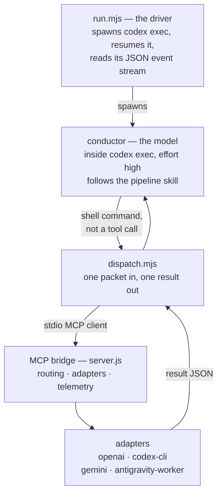

# Architecture

> **For:** understanding how a request flows through the harness, and what each file is for. **Also see:** [running.md](running.md) · [methodology.md](methodology.md) · [verification/p1-codex-runtime.md](verification/p1-codex-runtime.md)

The shape of this harness follows from one measured finding: a model running inside `codex exec` cannot call an MCP server's tools. Everything below is downstream of that.

## 1. Who calls what

In the Claude harness, the orchestrator subagent calls the bundled MCP server as a tool. That is not available here. Check 4 in [verification/p1-codex-runtime.md](verification/p1-codex-runtime.md) found that a model inside a plain `codex exec` session has no per-tool binding for this server — the MCP primitives codex does expose are Resources, and this server implements Tools.

So the driver calls the bridge, and the model never does:

The conductor dispatches by running a shell command. `dispatch.mjs` is an ordinary MCP client that spawns the bridge, calls one tool, and exits. That is why dispatch needs a session permitted to open pipes to a child process — see the sandbox entry in [troubleshooting.md](troubleshooting.md#dispatch-and-the-bridge).

## 2. The driver — `plugin/codex/run.mjs`

Spawns `codex exec` with a pinned model, reasoning effort, sandbox and approval policy, then resumes the same session until the pipeline signals completion.

- **Completion signal.** Phase 9 writes `manifest.json` and `SUMMARY.md`. `SUMMARY.md` is the signal, because only the final phase writes it.
- **Why resuming is normal.** One turn ends when the session hits its context ceiling — exit 0, no error. `--max-turns` (default 12) caps how many turns one run may use.
- **The fairness pin.** The model and effort are asserted against the policy before spending. A mismatch aborts rather than quietly running a different model than the one the cost figures will be attributed to. See `plugin/codex/telemetry/fairnessPin.mjs`.

## 3. The bridge — `plugin/mcp/model-dispatch/`

A stdio MCP server. Five tools, unchanged from the Claude harness:

| Tool | Purpose |
|---|---|
| `execute_with_model` | Route one TaskPacket to the model the policy names, and return the result. |
| `preflight_dispatch` | Prove every model this run would dispatch to is constructible, before spending. No API call. |
| `load_policy` | Return the parsed policy the run is operating under. |
| `simulate_policy` | Given the telemetry from a real run, recompute what it would have cost under a different policy. No model calls. |
| `log_telemetry` | Append one event to `telemetry.jsonl`. |

`driverClient.ts` is the client side — it spawns the server, sets a 900-second per-call timeout, and diagnoses a failed connection. The default MCP SDK timeout is 60 seconds, which is far below what a real dispatch at effort `high` takes; that mismatch killed a reference run once and the comment in that file records it.

## 4. Adapters — `plugin/mcp/model-dispatch/src/adapters/`

One per way of reaching a model. A policy names an adapter per model entry.

| Adapter | Reaches | Credential |
|---|---|---|
| `openai` | GPT through the OpenAI API | `OPENAI_API_KEY`, metered |
| `codex-cli` | GPT through a local `codex exec` subprocess | the CLI's own login — a ChatGPT seat |
| `mcp:model-dispatch` → `GeminiFlashAdapter` | Gemini as a model, one completion per packet | `GEMINI_API_KEY` or Google Cloud ADC |
| `antigravity-worker` | Gemini as an agent session with tools and a working directory | Vertex ADC only — no API-key door |

`BuiltinAnthropicAdapter` and `ClaudeCliAdapter` are carried from the source, compiled and tested, and never reached: no selectable policy names them.

The `openai` and `codex-cli` adapters reach the same model. They are separate because they bill differently, and keeping them distinct is what makes per-phase cost attribution honest — one produces metered figures, the other modeled ones.

## 5. Routing — `plugin/config/policies/*.yaml`

Routing is data, not code. Each policy declares `models:` (id, adapter, model name, pricing, auth) and `rules:` (a `when:` clause matched against phase and retry count, and the model to `use:`). First match wins; a bare `when:` is the fallback.

Two guardrails ship on: a mechanical packet that fails validation twice escalates to the judgment tier on the third attempt, and `hard_cost_cap_usd` aborts the run cleanly if accumulated cost crosses it.

The three selectable policies are described in [running.md](running.md#policies).

## 6. The two Gemini doors

Both reach the same model at the same rates. Which one an install uses is written to `.sdlc/local/mmo-select.json` by `verify-setup.mjs --enable-agent`, and the driver folds it into the environment it passes when it spawns the bridge.

This lives in install state rather than in the policy on purpose: the policy file stays a faithful record of how a run was priced and routed, rather than something edited between runs. The `model_id` on each telemetry event is what says which door ran.

## 7. The write contract — `plugin/codex/hooks/write-contract-check.mjs`

Brownfield only. A hook registered on both the native patch tool and shell commands, intercepting every attempted write before it reaches the filesystem. Writes outside the confirmed allowlist, or matching an off-limits pattern, are refused with a reason.

Every decision, allow or deny, is appended to `.sdlc/local/guard-decisions.jsonl`. That file exists because a denied call leaves no trace in the Codex event stream — without it, a refused write is invisible.

What the contract does and does not guarantee is stated plainly in the [README](../README.md#brownfield-mode-what-the-write-contract-actually-guarantees). The short version: the shell scan is a heuristic, not a shell parser, and fails open.

## 8. Telemetry — `plugin/codex/telemetry/`

Two sources feed one file:

- **Dispatched work.** Every `execute_with_model` call writes an event with vendor-reported token counts. `provenance: "vendor"`.
- **The driver loop.** `event-reader.mjs` parses the `codex exec --json` event stream and builds one event per turn from its usage figures. `provenance: "modeled"` — codex reports tokens but no money, so the cost is derived at the pinned rates.

The two are never summed. Why is in [methodology.md](methodology.md), and what the report does with them is in [understanding-output.md](understanding-output.md).

## 9. The command surface — `plugin/skills/`

Fifteen skills. Custom prompts are deprecated in codex and cannot ship inside a repository, so there is no slash-command surface; the reasoning is recorded in the verification file.

Two of the fifteen are not invoked directly. `pipeline` is the state machine, gates and per-phase prompts the conductor reads. `brownfield-guide` is the shared seven-step manual every brownfield entry point points at — one manual, one Gate 0, no second pipeline behind the seven job aliases.

## 10. Install routes

| Route | What it means | Update path |
|---|---|---|
| Plugin, from a Git marketplace | Codex holds a snapshot | `codex plugin marketplace upgrade` |
| Plugin, from a local path | The install resolves to the working tree; edits are live | `git pull` — there is nothing else to update |
| Clone | Working on the harness itself | `git pull`, then `node plugin/codex/verify-setup.mjs --fix` |

`dist/` and `node_modules/` are not tracked, so every route needs one build before the bridge can dispatch.
